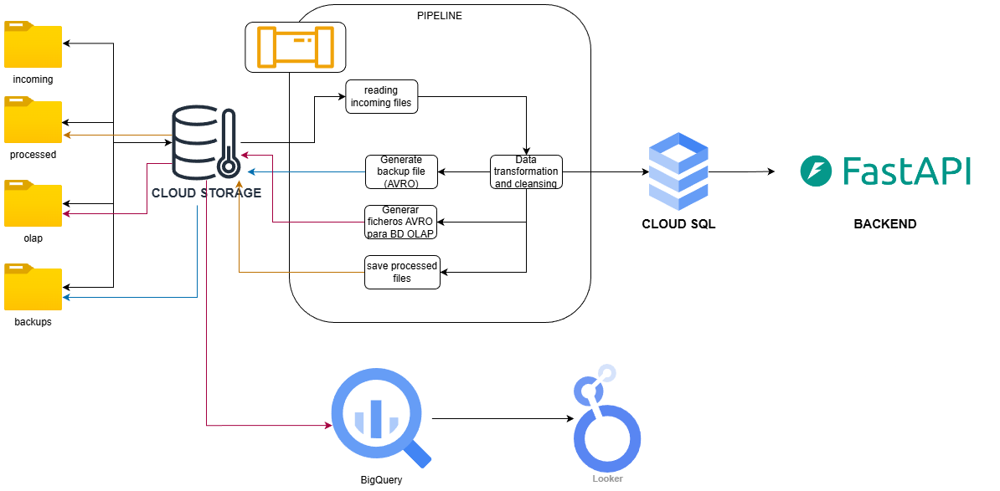

# challenge_globant
Technical challenge for application for data engineer position at GLOBANT

## Architecture

## Architecture Diagram

*High-level architecture for CSV ingestion, REST API, OLTP/OLAP separation, and AVRO backup on GCP.*

- GCP Cloud Storage
- FastAPI
- PostgreSQL (Cloud SQL)

## Database Architecture

The project uses two database models:

- **OLTP**: normalized schema for transactional data ingestion.
- **OLAP**: star schema optimized for analytical queries and reporting.

## Features
- CSV batch ingestion
- REST API batch insert
- Data validation
- AVRO backup & restore

## How to run locally
## How to deploy on GCP
